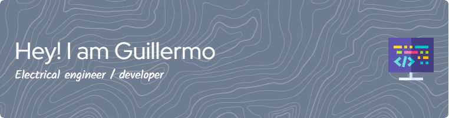

## As an Engineer, I have experience:
* Designing PCBs from the concept to the final product using noise reduction techniques and power distribution :electric_plug:.
* :computer: Simulating and creating PID controllers, space state pole placement, digital control systems, stability calculus and Observers.
* Using Comunication protocols lif RF, SPI, I2C, wifi, bluetooth, etc.
* Implementing Raspberry PI solutions, STM32, ESP32
* Industrial Instrumentation and sensors selection.
* Robotics and computer vision
## On the other hand as a Software developer:
* 3 years working as a fullstack developer gave me the opportunity to perform maintenance and create DBs such as  and . Use REST and Graphql protocols, and make frontend responsive designs with ,  and .
* Implement machine learning algorithms to do object detection (YOLO, SSD), scene segmentation, clasification and linear regression for predictions, all of them on , ,  and .

Languages and tools
--- 

Social media
---

  

